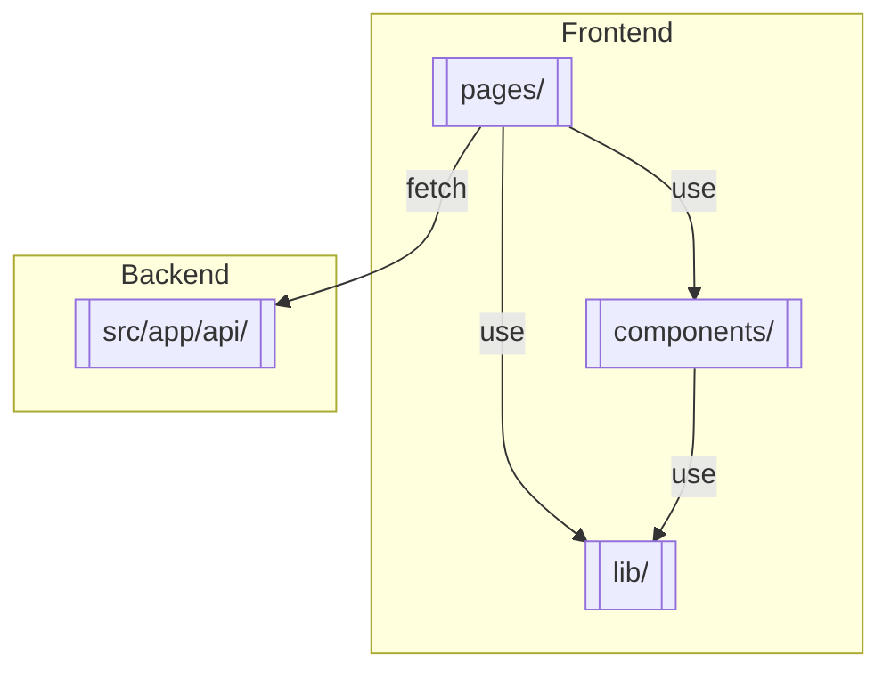

# Agentic AI Commerce

A simple ecommerce app built with Next.js. The backend uses Next.js API routes to expose mock APIs and the frontend employs a mobile-first React design. Tests cover API and UI behavior.

- [Commercetools Apparel Product Model](docs/commercetools-product-model.md)
- [Architecture Overview](docs/architecture.md)

## Code Structure

The application is built entirely with Next.js and uses API routes for the backend functionality.
The diagram below highlights the major folders:



Key files:

- [pages/index.js](pages/index.js) – home page listing products
- [pages/products/[id].js](pages/products/%5Bid%5D.js) – product detail page
- [components/ProductList.js](components/ProductList.js) – renders product grid
- [lib/cartContext.js](lib/cartContext.js) – in-memory cart store
- [src/app/api/](src/app/api/) – mock API endpoints

## Development

```bash
npm install
npm run dev
```

This starts the Next.js dev server (including API routes) on port 3000.

Run tests:

```bash
npm test          # unit tests
npm run test:e2e  # Playwright end-to-end tests
# Run `npx playwright install` once before running e2e tests.
```
