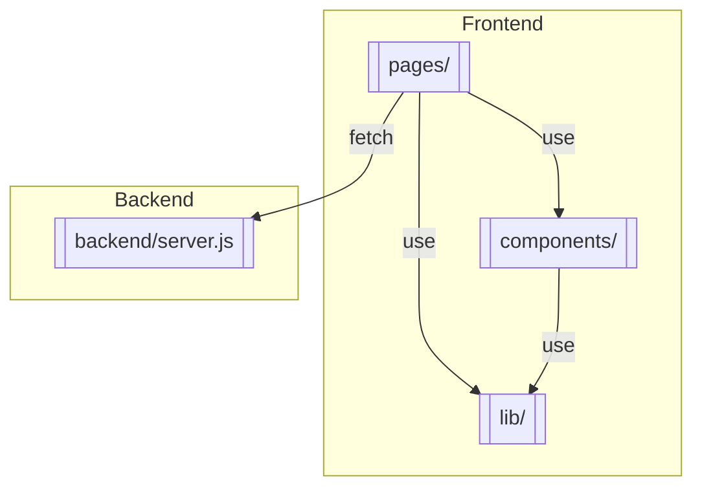

# Agentic AI Commerce

A simple ecommerce app built with Next.js and Express. The backend exposes mock APIs and the frontend uses a mobile-first React design. Tests cover API and UI behavior.

- [Commercetools Apparel Product Model](docs/commercetools-product-model.md)
- [Architecture Overview](docs/architecture.md)

## Code Structure

The application is split between a simple Express backend and a Next.js frontend.
The diagram below highlights the major folders:



Key files:

- [pages/index.js](pages/index.js) – home page listing products
- [pages/products/[id].js](pages/products/%5Bid%5D.js) – product detail page
- [components/ProductList.js](components/ProductList.js) – renders product grid
- [lib/cartContext.js](lib/cartContext.js) – in-memory cart store
- [backend/server.js](backend/server.js) – mock API endpoints

## Development

```bash
npm install
npm run dev
```

This starts the Express API on port 3001 and Next.js on port 3000.

Run tests:

```bash
npm test             # unit tests
npm run test:coverage # unit test coverage
npm run test:e2e     # Playwright end-to-end tests
npm run cypress      # proxy command for Cypress (uses Playwright)
```

End-to-end tests use **Playwright** and should maintain over **70% coverage**.
Run `npx playwright install` once before executing the E2E suite.
