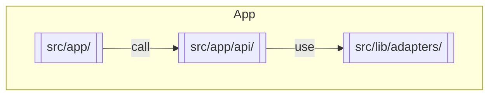

# Agentic AI Commerce

A simple ecommerce app built with Next.js. Mock APIs are served via built-in Next.js API routes and the frontend uses a mobile-first React design. Tests cover API and UI behavior.

- [Commercetools Apparel Product Model](docs/commercetools-product-model.md)
- [Architecture Overview](docs/architecture.md)

## Code Structure

All server functionality lives in Next.js API routes under `src/app/api`. These
routes call adapters in `src/lib/adapters` which in turn communicate with
external commerce APIs or return mock data. The diagram below highlights the
major folders:



Key files:

- `src/app/page.js` – home page listing products
- `src/app/products/[id]/page.js` – product detail page
- `src/lib/cartContext.js` – in-memory cart store
- `src/app/api/mock/[...mockEndpoints].ts` – local mock API routes
- `src/lib/adapters/commercetoolsAdapter.ts` – CommerceTools adapter
- `src/lib/adapters/shopifyAdapter.ts` – Shopify adapter

## Development

```bash
npm install
```

Initialize TypeScript (optional but recommended):

```bash
npx tsc --init
```

Create a `.env.local` file for API credentials. Example:

```env
CT_API_URL=https://api.example.com
SHOPIFY_URL=https://shop.example.com
SHOPIFY_TOKEN=token
```

Start the development server:

```bash
npm run dev
```
The app will be available at `http://localhost:3000`.

Run tests:

```bash
npm test          # unit tests
npm run test:e2e  # Playwright end-to-end tests
# Run `npx playwright install` once before running e2e tests.
```
