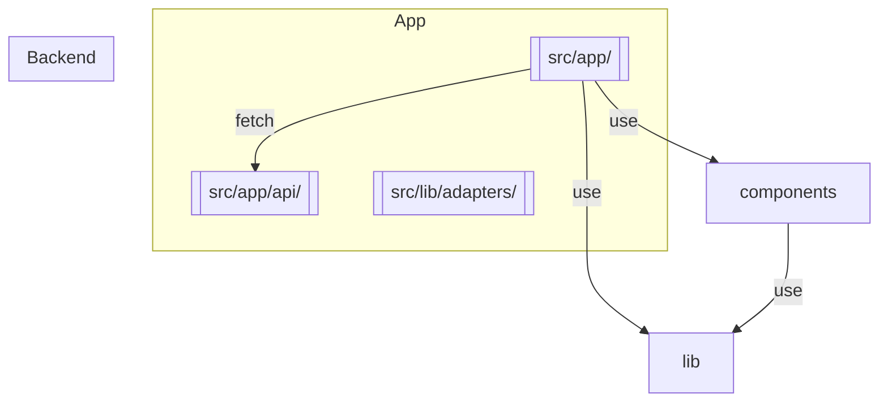

# Agentic AI Commerce


A simple ecommerce app built with Next.js. The backend uses Next.js API routes to expose mock APIs and the frontend employs a mobile-first React design. Tests cover API and UI behavior.


- [Commercetools Apparel Product Model](docs/commercetools-product-model.md)
- [Architecture Overview](docs/architecture.md)
- [Deployment Guide](docs/deployment.md)

## Code Structure

The application is built entirely with Next.js and uses API routes for the backend functionality.
The diagram below highlights the major folders:




Key files:

- [pages/index.js](pages/index.js) – home page listing products
- [pages/products/[id].js](pages/products/%5Bid%5D.js) – product detail page
- [components/ProductList.js](components/ProductList.js) – renders product grid
- [lib/cartContext.js](lib/cartContext.js) – in-memory cart store
- [src/app/api/](src/app/api/) – mock API endpoints


## Development

```bash
npm install
```

Initialize TypeScript (optional but recommended):

```bash
npx tsc --init
```

Create a `.env.local` file for API credentials. Example:

```env
CT_API_URL=https://api.example.com
SHOPIFY_URL=https://shop.example.com
SHOPIFY_TOKEN=token
```

Start the development server:

```bash
npm run dev
```
The app will be available at `http://localhost:3000`.

### Environment Variables

This starts the Next.js dev server (including API routes) on port 3000.

Run tests:

```bash
npm test             # unit tests
npm run test:coverage # unit test coverage
npm run test:e2e     # Playwright end-to-end tests
npm run cypress      # proxy command for Cypress (uses Playwright)
```

## Security

The Express backend applies [Helmet](https://github.com/helmetjs/helmet) to set
secure HTTP headers. CORS is restricted to requests from
`http://localhost:3000` by default. You can override the allowed origin by
setting the `CLIENT_ORIGIN` environment variable.
