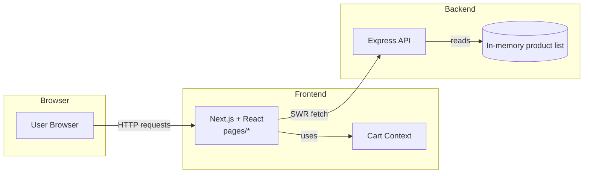
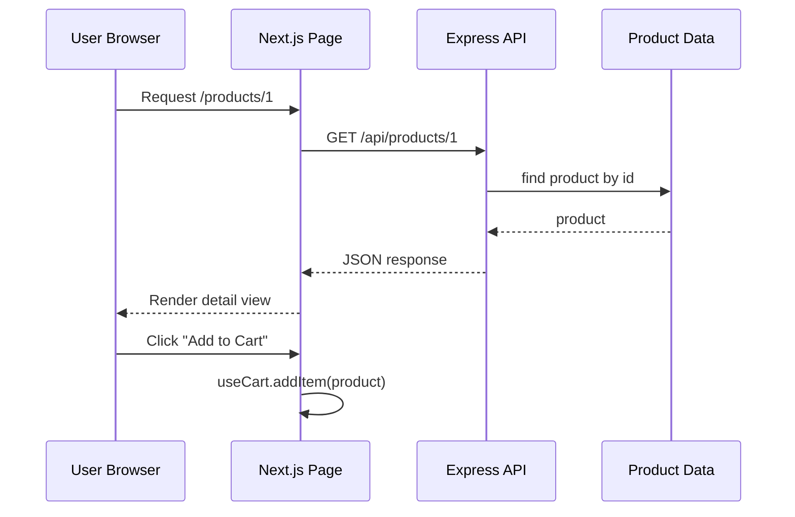

# Architecture Overview

This document describes the high-level architecture for the Agentic AI Commerce application. It illustrates how the frontend and backend interact and highlights important source files.

## System Context



The Next.js frontend listens on port `3000` and the Express backend serves a mock API on port `3001`. Cart state is maintained client side in `lib/cartContext.js` while data is fetched from the API using SWR.

### Key Components

#### Backend (`backend/server.js`)
```javascript
app.get('/api/products', (req, res) => {
  res.json(products);
});

app.get('/api/products/:id', (req, res) => {
  const product = products.find(p => p.id === parseInt(req.params.id));
  if (product) return res.json(product);
  res.status(404).json({ message: 'Product not found' });
});
```

#### Home Page (`pages/index.js`)
```javascript
const fetcher = url => fetch(url).then(r => r.json());

export default function Home() {
  const { data } = useSWR('http://localhost:3001/api/products', fetcher);
  return (
    <Layout>
      <h1>Store</h1>
      {data ? <ProductList products={data} /> : 'Loading...'}
    </Layout>
  );
}
```

#### Product Detail (`pages/products/[id].js`)
```javascript
const fetcher = url => fetch(url).then(r => r.json());

export default function ProductDetail() {
  const router = useRouter();
  const { id } = router.query;
  const { data } = useSWR(id ? `http://localhost:3001/api/products/${id}` : null, fetcher);
  const { addItem } = useCart();
  // ...render product and add-to-cart button...
}
```

#### Cart Context (`lib/cartContext.js`)
```javascript
export function CartProvider({ children }) {
  const [items, setItems] = useState([]);
  const addItem = item => setItems([...items, item]);
  const value = { items, addItem };
  return <CartContext.Provider value={value}>{children}</CartContext.Provider>;
}
```

## Sequence: Adding a Product to the Cart



When a user views a product detail page, the page fetches the product from the Express API and renders it. Selecting **Add to Cart** calls `useCart.addItem`, storing the product in React context.
